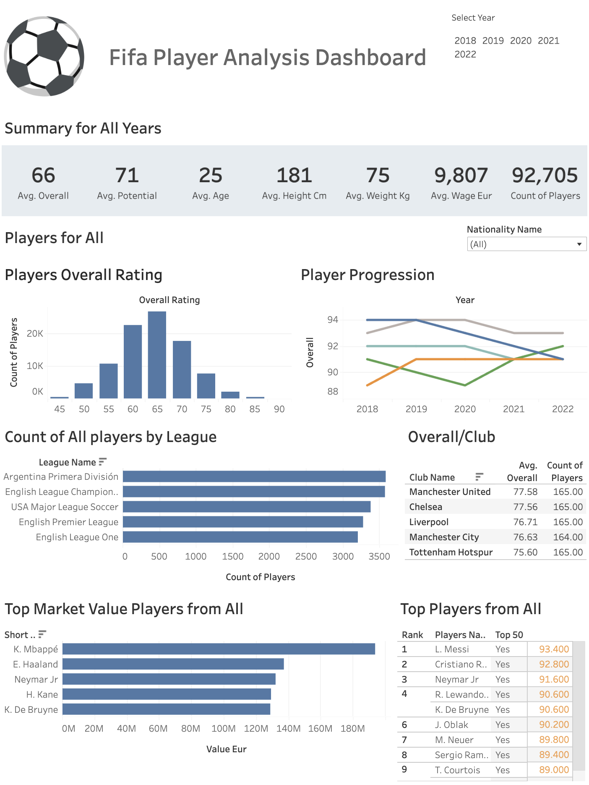

# FIFA Player Analysis Dashboard

## Project Overview
Welcome to the FIFA Player Analysis Dashboard. This [interactive dashboard](https://napronald.github.io/FifaDashboard/), created using Tableau, provides detailed insights into FIFA player statistics from the years 2018 to 2022. The purpose of this dashboard is to help users explore various metrics such as player ratings, club performances, and market values of top players.
  
## Data Source
The data used for this dashboard was sourced from the [FIFA 22 Complete Player Dataset on Kaggle](https://www.kaggle.com/datasets/stefanoleone992/fifa-22-complete-player-dataset?select=players_22.csv). This comprehensive dataset includes player attributes, ratings, and other relevant statistics which are updated annually.

## Dashboard Features
- **Player Ratings Analysis:** Compare the evolution of player ratings across different seasons.
- **Club Performance Metrics:** Analyze the performance metrics of different clubs over multiple seasons.
- **Market Value Insights:** Examine the market value trends of top players in the international arena.

## Interactive Dashboard
Explore the interactive dashboard built on Tableau to dive deeper into the data and gain actionable insights. Access the Tableau dashboard here:
[Tableau FIFA Dashboard](https://public.tableau.com/app/profile/ronald8274/viz/fifa_16723669132800/Dashboard13)

## Usage
- Navigate through different nations to explore various data visualizations.
- Use filters to customize the data display according to player, club, or season.
- Gain insights into the dynamics of player stats and market trends to inform sports analysis and scouting activities.

